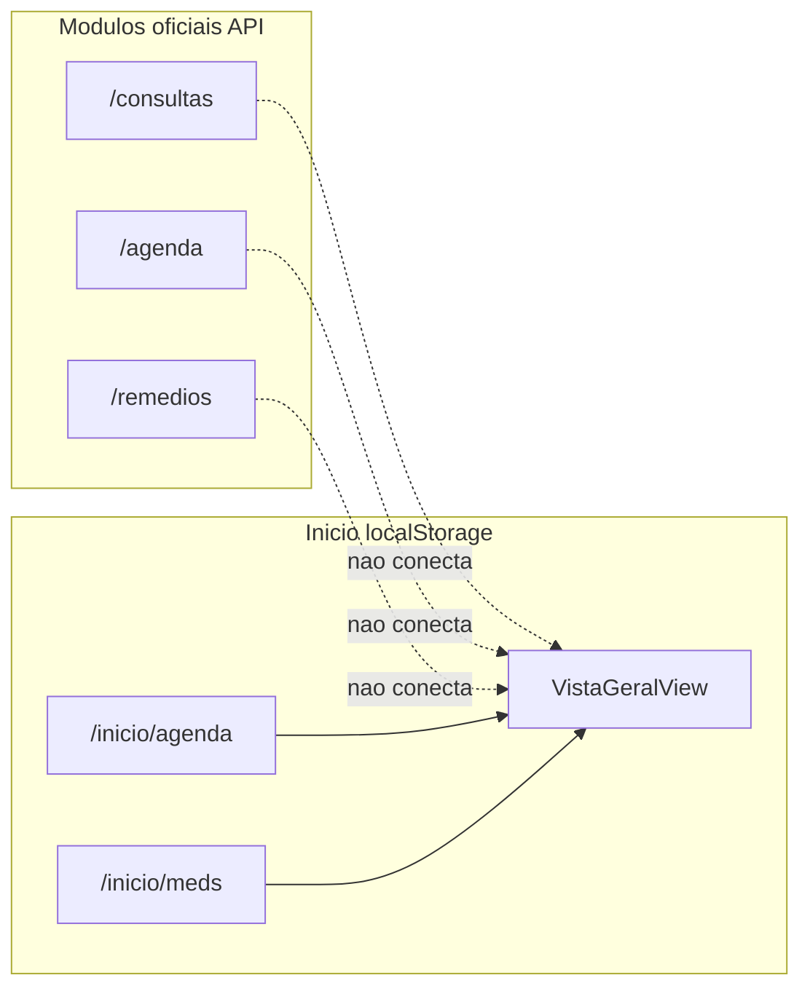

# Relatório e opinião — sugestões VitaLink

## Veredicto

As sugestões são **coerentes com o produto** (cuidado diário, LGPD, estoque e impressão). A maior parte dos “bugs” do Início não é falha pontual: há **dois mundos paralelos** — o módulo **Início** ainda lê `localStorage` (legado do protótipo), enquanto **Consultas/Sessões**, **Agenda do Paciente** e **Medicamentos** oficiais usam a API PostgreSQL. Por isso Compromissos/Medicamentos do Início “não alimentam” o que foi cadastrado em Saúde/Atividades.

Recomendação estratégica: **unificar o Início na API** (agenda + remédios + administração) e só então evoluir estoque/impressão/diretório. Sem isso, qualquer melhoria no Início continua “fantasma”.

Anexos citados (modelo de estoque, lista de medicamentos, termo/privacidade) **não estão no repositório** — a implementação de impressão e da página legal depende deles.

---

## Diagnóstico técnico (causa raiz)

- Compromissos/Medicamentos do Início: [`VistaGeralView.jsx`](frontend/src/pages/Inicio/views/VistaGeralView.jsx) via `storageGet('appointments'|'medicines')`.
- Checkbox “tomei hoje” **já existe** no Início, mas só marca IDs no `localStorage` — **não chama** `POST /remedios/:id/administrar` (baixa real de estoque).
- Dashboard (`/dashboard`) já consome API; Início não.
- Mapa corporal e perfil do Início também são locais ([`CorpoView.jsx`](frontend/src/pages/Inicio/views/CorpoView.jsx)), não a ficha oficial do paciente.

---

## Inventário por item

### Já ok / manter
Dashboard; Estabelecimentos/Farmácias/Empresas/Cuidadores (Admin); Agenda do Paciente; Consultas/Sessões (Admin); Eventos; Usuários/Perfis/Acessos/Auditoria (Admin); Medicamentos no geral (CRUD oficial bem avaliado).

### Bug / desalinhamento (alta prioridade)
| Pedido | Situação atual |
|--------|----------------|
| Compromissos da semana ← Consultas/Sessões | Início lê agenda **local**, não `/agenda` nem `/consultas` |
| Medicamentos de hoje ← novo medicamento | Início lê meds **locais**, não `/remedios` |
| Checkbox diário + baixa estoque | Checkbox local existe; baixa oficial existe em Remédios, mas **não estão ligados** |
| Saudação Admin / Responsável | Texto fixo “Como está sua saúde hoje?” em [`VistaGeralView.jsx`](frontend/src/pages/Inicio/views/VistaGeralView.jsx) |

### Parcialmente pronto (aproveitar)
| Pedido | Situação |
|--------|----------|
| Atribuir paciente a Responsável(eis) | Já existe `responsavel_ids` / `paciente_responsaveis` na ficha do paciente |
| Vincular cuidadores | Já existe aba Cuidadores + `paciente_cuidador_vinculos` |
| Baixa de estoque | `POST /remedios/:id/administrar` + `quantidade_estoque` |
| Imprimir lista de medicamentos | “Imprimir Lista” existe; falta layout paisagem/logo/20 itens + modelo anexo |
| Tooltip especialidade no mapa | `title` já existe; falta lado esquerdo do peito, link para pasta Exames/Receitas e dados da ficha oficial |

### Novo / médio esforço
- Início Admin como **diretório** Hospitais / Clínicas / Labs / Profissionais por especialidade com links para fichas (escopo por paciente nos outros perfis).
- Classificação de estabelecimentos: hoje `hospitais_clinicas` **não tem** tipo Hospital/Clínica/Laboratório — será preciso campo `tipo_estabelecimento` (ou equivalente).
- Simplificar form de Profissionais (remover Endereço/Turno/Foto; locais filtrados por paciente).
- Câmera no celular para foto do paciente e Novo Documento (hoje `FileUploadField` é `input type=file`; no mobile às vezes abre câmera, mas não há captura dedicada).
- Timeline → deep-link para Evento/rotina detalhado.
- Busca por palavras-chave nos Eventos → card na Linha do Tempo.
- Fluxo Responsável: dropdown de pacientes + check-in “Como está a saúde do seu paciente hoje?”.
- Menus faltantes no Responsável: Estabelecimentos, Cuidadores, Consultas/Sessões.
- Página Termos e Política no menu (conteúdo do anexo).
- Botão **Imprimir estoque** + previsão de reposição (lead time / dias restantes).
- Médico prescritor opcional (hoje obrigatório no backend `requiredCreate`).

### Atenção / risco (não implementar “como pedido” sem escopo)
**Responsável com Usuários / Perfis / Acessos:** liberar as telas admin completas quebra o modelo de segurança. O correto é **administração escopada**: só usuários vinculados aos pacientes do Responsável, sem criar/alterar Admin, sem matriz global de Perfis/Acessos. Perfis e Acessos globais devem permanecer Admin-only; para Responsável, preferir “convidar Cuidador/Paciente” com papéis fixos.

**Cuidador:** pedido foca Pacientes/Medicamentos/Agenda/Eventos/Timeline — alinhado ao RBAC atual (leitura). Evitar expandir menus sem necessidade.

---

## Opinião por bloco (resumo)

**Início** — Prioridade máxima. Unificar fontes de dados; diferenciar UI por perfil (Admin = diretório institucional; Responsável/Cuidador/Paciente = cuidado diário + escopo). O diretório do Admin é útil, mas **não substitui** o painel operacional de compromissos/medicação para quem cuida — manter os dois modos por perfil.

**Estoque + checkboxes** — Excelente para o dia a dia. Reusar `administrarRemedio`; no checkbox, baixar só na 1ª marcação do dia e ter regra clara ao desmarcar (não estornar automaticamente, ou pedir confirmação).

**Impressões** — Viável com CSS `@media print` / janela de impressão; modelos anexos são indispensáveis para bater 1 página paisagem com ≤20 itens.

**Mapa corporal** — Ajuste fino de coordenadas (ex.: Cardiologia `left` ~35–40%, não centro) + ligar especialidades da ficha oficial/`paciente_medicos` + link `/exames-receitas?especialidade=...`.

**Profissionais** — Simplificação faz sentido; “locais do paciente” exige filtrar estabelecimentos via vínculos paciente↔médico↔hospital.

**Termos** — Item legal obrigatório; página estática + item de menu para todos os perfis; aceite no login pode ficar para fase 2.

---

## Priorização recomendada (ondas)

### Onda A — Consistência e confiança (1–2 sprints)
1. Ligar Início à API: compromissos (`/agenda` + consultas da semana) e medicamentos de hoje (`/remedios` do paciente em contexto).
2. Checkbox diário → `POST .../administrar` (com anti-duplicidade no dia).
3. Saudações por perfil (Admin sem pergunta clínica; Responsável “De quem você irá cuidar hoje?” + seletor de pacientes).
4. Prescritor opcional; botões Imprimir estoque / refino da lista (após receber anexos).
5. Menus Responsável: Estabelecimentos, Cuidadores, Consultas (CRUD alinhado ao escopo).

### Onda B — Ficha clínica e documentos
1. Câmera/capture em foto do paciente e exames/receitas.
2. Mapa corporal posicionado + tooltip + link para pasta.
3. Form Profissionais enxuto.
4. Timeline com link para detalhe do evento; busca por palavra-chave.
5. Check-in diário do Responsável no paciente selecionado.

### Onda C — Diretório, legal e admin escopado
1. Início Admin = resumo instituições/profissionais com links; outros perfis filtrados pelos pacientes vinculados.
2. Campo tipo de estabelecimento (Hospital/Clínica/Laboratório).
3. Página Termos e Privacidade no menu.
4. Gestão de usuários subordinados pelo Responsável (escopo restrito; sem Perfis/Acessos globais).

---

## Dependências antes de implementar
- Anexos: Proposta Estoque, Proposta Lista de Medicamentos, Termo e Política.
- Confirmar se o Início do **Paciente** também perde a saudação clínica ou só o Admin (pedido atual: retirar só no Admin).
- Confirmar se “Eventos” da Timeline é `/rotina` (menu atual) ou o prontuário local `/inicio/eventos` — hoje o menu “Eventos” aponta para rotina de medicamentos.

---

## Escopo fora (manter como está)
Tudo não citado nas sugestões permanece inalterado, inclusive fluxos já avaliados como “ótimo/ok”.
