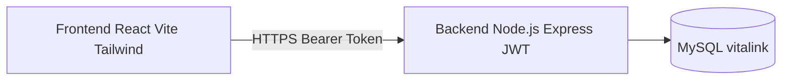
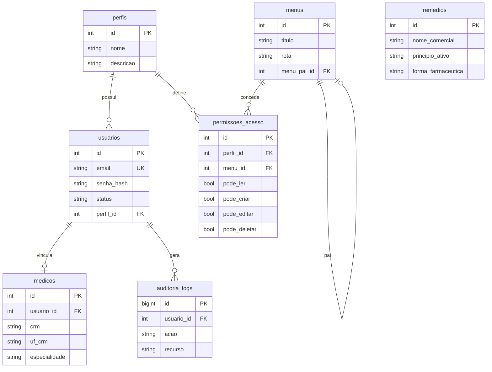

# VitaLink

Plataforma inteligente de **gestão de saúde e monitoramento contínuo no lar**.

> **Cuidado contínuo para quem você ama, onde ele estiver.**

Monitoramento diário de saúde, rotina de medicamentos e suporte integrado para **pacientes, cuidadores e médicos**, com privacidade alinhada à **LGPD**.

Repositório: [github.com/geninho33/vitalink](https://github.com/geninho33/vitalink)

---

## Visão geral da arquitetura



| Camada | Tecnologia | Pasta |
|--------|------------|-------|
| Frontend | React 18 + Vite + TailwindCSS | `frontend/` |
| Backend | Node.js + Express + mysql2 + JWT + RBAC | `backend/` |
| Banco | MySQL 5.7+/8 (`utf8mb4`) | `database/schema.sql` |
| Documentação SDD | Spec funcional + contratos OpenAPI | `docs/` |

Há ainda um protótipo legado mobile-first na raiz (`index.html` / `script.js` / `localStorage`), separado do fluxo autenticado da API.

---

## Documentação SDD (Item 3)

| Documento | Descrição |
|-----------|-----------|
| [`docs/especificacao-funcional.md`](docs/especificacao-funcional.md) | Propósito, branding, módulos, atores e casos de uso |
| [`docs/api-contracts.md`](docs/api-contracts.md) | Contratos REST / OpenAPI YAML |
| [`docs/Ambiente.md`](docs/Ambiente.md) | Variáveis de ambiente |
| [`docs/Arquitetura.md`](docs/Arquitetura.md) | Notas de arquitetura |

---

## Guia de instalação e configuração local

### Pré-requisitos

- Node.js 18+
- MySQL em execução (serviço local)
- Credenciais de desenvolvimento: usuário `root` / senha `masterkey`

### 1. Clonar e entrar no projeto

```bash
git clone git@github.com:geninho33/vitalink.git
cd vitalink
git checkout dev
```

### 2. Criar o banco e aplicar o schema

No Windows (PowerShell), com o cliente MySQL no PATH ou caminho completo:

```powershell
Get-Content -Raw .\database\schema.sql |
  & "C:\Program Files\MySQL\MySQL Server 5.7\bin\mysql.exe" -h localhost -u root -pmasterkey --default-character-set=utf8mb4
```

Ou, em bash:

```bash
mysql -h localhost -u root -pmasterkey --default-character-set=utf8mb4 < database/schema.sql
```

Parâmetros:

| Parâmetro | Valor |
|-----------|-------|
| Host | `localhost` |
| Usuário | `root` |
| Senha | `masterkey` |
| Database | `vitalink` |

### 3. Subir a API

```bash
cd backend
cp .env.example .env
npm install
npm run dev
```

Health check: [http://localhost:3333/health](http://localhost:3333/health)

### 4. Subir o frontend

```bash
cd frontend
cp .env.example .env
npm install
npm run dev
```

Abra a URL indicada pelo Vite (ex.: `http://localhost:5173` ou outra porta livre).

### Credencial seed (somente desenvolvimento)

| Campo | Valor |
|-------|-------|
| E-mail | `admin@vitalink.local` |
| Senha | `Admin@Vitalink1` |

Altere a senha e o `JWT_SECRET` antes de qualquer ambiente compartilhado.

---

## Mapeamento do banco de dados

Script canônico: [`database/schema.sql`](database/schema.sql)

### Diagrama ER (simplificado)



### Entidades principais

| Tabela | Função |
|--------|--------|
| `perfis` | Papéis RBAC (Admin, Médico, Atendente/Cuidador…) |
| `menus` | Itens de navegação dinâmica |
| `usuarios` | Contas autenticáveis |
| `permissoes_acesso` | Flags CRUD por perfil × menu |
| `medicos` | Cadastro profissional (CRM/UF) |
| `remedios` | Catálogo farmacêutico |
| `auditoria_logs` | Trilha de conformidade (sem dump clínico) |

> Extensões de domínio (paciente, rotina diária, registro de dose, diário de bordo) estão especificadas em `docs/especificacao-funcional.md` e `docs/api-contracts.md`.

---

## Política de segurança LGPD

O VitaLink trata dados de saúde como **dados sensíveis**. Diretrizes obrigatórias:

1. **Minimização** — coletar e exibir apenas o necessário ao cuidado.
2. **Controle de acesso** — RBAC + vínculos (cuidador/médico/familiar ↔ paciente).
3. **Logs sanitizados** — o logger da API redige campos como `senha`, `email`, tokens e conteúdos clínicos; ver `backend/src/utils/logger.js`.
4. **Auditoria enxuta** — `auditoria_logs` registra ação, recurso, id, IP e user-agent — **não** grava prontuário completo.
5. **Sem seeds clínicos reais** — proibido popular o banco com dados reais de pacientes/prontuários.
6. **Segredos fora do Git** — `.env` está no `.gitignore`; use apenas `.env.example` versionado.

Em caso de incidente, revogar JWT (troca de `JWT_SECRET`), revisar `auditoria_logs` e notificar titulares conforme a LGPD.

---

## Estrutura do repositório

```text
vitalink/
├── backend/                 # API Express + JWT + RBAC
├── frontend/                # React (Login + shell)
├── database/schema.sql      # Schema MySQL
├── docs/
│   ├── especificacao-funcional.md
│   ├── api-contracts.md
│   └── ...
├── README.md
└── (protótipo legado na raiz)
```

---

## Licença

MIT — ver [`LICENSE`](LICENSE).
