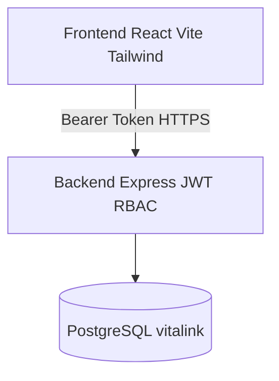

# Arquitetura

## Visão geral

Arquitetura em três camadas para a v1 SDD:

| Camada | Tecnologia | Pasta |
|--------|------------|-------|
| Frontend | React 18 + Vite + TailwindCSS | `frontend/` |
| Backend | Node.js + Express + pg + JWT | `backend/` |
| Banco | PostgreSQL 16 (UTF8) | `database/schema.postgres.sql` |

O protótipo estático legado (`index.html`, `script.js`) permanece na raiz e **não** faz parte do fluxo autenticado.

---

## Módulos

1. **Segurança e Acesso** — auth JWT, usuários, perfis, menus, permissões
2. **Saúde** — pacientes, médicos, remédios, hospitais, farmácias, cuidadores, responsáveis
3. **Atividades** — agenda, consultas, rotina, anamnese, timeline
4. **Auditoria** — `auditoria_logs` + logger sanitizado

---

## Autenticação

1. Cliente envia `POST /api/v1/auth/login` com e-mail/senha
2. API valida hash bcrypt e status
3. Emite JWT (`sub` = user id, `perfilId`)
4. Cliente envia `Authorization: Bearer <token>` nas demais rotas
5. Middleware `authenticate` + `requirePermission(rota, ação)` aplica RBAC

---

## Segurança e LGPD

- Helmet + CORS restrito por origem
- Senhas nunca retornadas pela API
- Logger redige PII / dados clínicos
- Auditoria grava metadados mínimos (ação, recurso, IP)

---

## Deploy local (dev)

1. Criar DB: `psql ... -f database/schema.postgres.sql`
2. Backend: `cd backend && cp .env.example .env && npm i && npm run dev`
3. Frontend: `cd frontend && cp .env.example .env && npm i && npm run dev`

Ou stack completa: `cd deploy && ./deploy.sh up`
