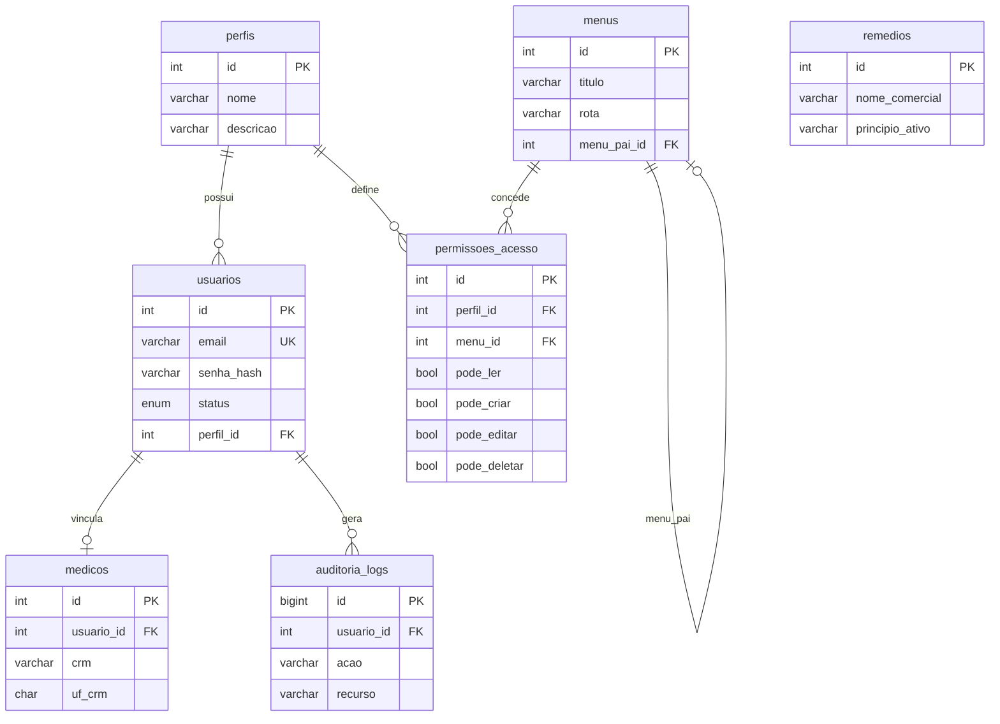

# Banco de Dados

## Conexão (desenvolvimento)

| Parâmetro | Valor |
|-----------|-------|
| Host | `localhost` |
| Porta | `3306` |
| Usuário | `root` |
| Senha | `masterkey` |
| Database | `vitalink` |

Script canônico: [`database/schema.sql`](../database/schema.sql)

```bash
mysql -h localhost -u root -pmasterkey < database/schema.sql
```

---

## Diagrama lógico



---

## Tabelas

| Tabela | Módulo |
|--------|--------|
| `perfis` | RBAC |
| `menus` | RBAC |
| `usuarios` | RBAC |
| `permissoes_acesso` | RBAC |
| `medicos` | Clínico |
| `remedios` | Prescrição |
| `auditoria_logs` | Conformidade |

---

## Seeds

- Perfis: Administrador, Médico, Atendente
- Menus: Dashboard, Usuários, Perfis, Médicos, Remédios, Auditoria
- Usuário admin: `admin@vitalink.local` / `Admin@Vitalink1`
- **Sem** seeds de pacientes, prontuários ou dados clínicos reais
