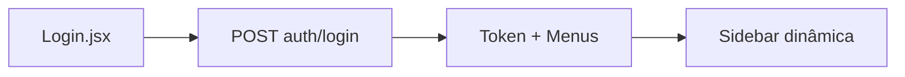

# Fluxo de Telas

## Login → Sessão

1. Usuário informa e-mail e senha
2. Validação client-side em tempo real
3. Loading no botão “Entrar no Sistema”
4. Sucesso: persiste `vitalink.token`, `vitalink.usuario`, `vitalink.menus`
5. Erro: alerta visual sem expor detalhes internos do servidor

## Navegação autenticada (planejada)

Menus retornados pela API montam a sidebar. Cada rota exige permissão `pode_ler` no perfil.

| Rota | Tela |
|------|------|
| `/dashboard` | Painel |
| `/usuarios` | Gestão de usuários |
| `/perfis` | Perfis e permissões |
| `/medicos` | Cadastro de médicos |
| `/remedios` | Catálogo de remédios |
| `/auditoria` | Logs de conformidade |
