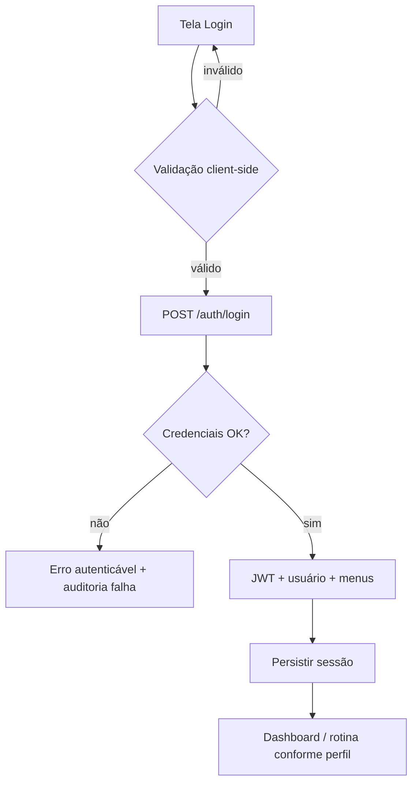

# Especificação Funcional — VitaLink (SDD Item 3)

**Versão:** 1.1  
**Metodologia:** Spec-Driven Development (SDD)  
**Status:** Documento canônico de produto e regras de negócio

---

## 1. Contexto e propósito do sistema

O **VitaLink** é uma plataforma inteligente de **gestão de saúde e monitoramento contínuo no lar**. Foi projetado para:

- Acompanhar a rotina diária de pacientes idosos, pessoas com Alzheimer, perda de memória ou pacientes em geral que necessitam organizar seus cuidados de saúde.
- Conectar e facilitar o trabalho de **cuidadores, familiares e médicos**, garantindo o cumprimento de rotinas médicas, tomada correta de remédios e registros de saúde em tempo real.
- Garantir a **privacidade e a segurança dos dados** em conformidade com a **LGPD**.

### 1.1. Problema que resolve

Famílias e cuidadores enfrentam dificuldade em lembrar horários de medicamentos, registrar sintomas e compartilhar informações confiáveis com o médico. O VitaLink centraliza rotina, confirmação de doses, diário de bordo e visão clínica, com controle de acesso por perfil.

### 1.2. Escopo desta especificação

| Em escopo | Fora de escopo (v1.1) |
|-----------|------------------------|
| RBAC (Administrador, Médico, Cuidador, Paciente/Familiar) | Teleconsulta / vídeo |
| Cadastro de paciente e perfil de saúde | Integração com farmácias |
| Rotina e alertas de medicamentos | Dispositivos IoT wearable |
| Diário de bordo do cuidador | App nativo iOS/Android |
| Painel médico, adesão e exportação PDF | Prescrição com assinatura digital ICP-Brasil |

---

## 2. Branding e identidade da interface (Landing / Login)

Textos oficiais da tela de autenticação (implementação de referência: `frontend/src/pages/Login.jsx`).

### 2.1. Título / Slogan principal

> **Cuidado contínuo para quem você ama, onde ele estiver.**

### 2.2. Subtexto de apoio

> Monitoramento diário de saúde, rotina de medicamentos e suporte integrado para pacientes, cuidadores e médicos.

### 2.3. Destaques no card institucional

1. **Acesso com perfil e permissões:** Menus dinâmicos adaptados para Médicos, Cuidadores, Pacientes e Administradores.
2. **Proteção de dados sensíveis:** Trilha de auditoria sanitizada, sem gravação de logs com dados clínicos expostos.

### 2.4. Diretrizes visuais

- Paleta: azul corporativo, verde menta / aqua, branco e cinza ardósia.
- Layout de login: split-screen (institucional à esquerda, formulário à direita).
- Tom de voz: acolhedor, claro, profissional — sem alarmismo clínico.

---

## 3. Atores do sistema

| Ator | Descrição |
|------|-----------|
| **Administrador** | Gerencia usuários, perfis, permissões e vínculos cuidador–paciente. |
| **Médico** | Consulta adesão, linha do tempo, prescreve/ajusta medicamentos e exporta relatórios. |
| **Cuidador** | Executa rotina diária: confirma doses, registra sintomas, alimentação e observações. |
| **Paciente / Familiar** | Visualiza rotina autorizada, histórico resumido e alertas da própria rede de cuidado. |

---

## 4. Módulos e casos de uso

### 4.1. Módulo de Gestão de Acessos e Perfis (RBAC)

#### Objetivo

Controlar autenticação JWT, usuários, perfis e menus dinâmicos, garantindo **acesso estrito** apenas às rotas associadas ao perfil.

#### Regras de negócio

1. Cada usuário possui **um** `perfil_id` ativo.
2. Menus e ações (ler/criar/editar/deletar) são resolvidos em `permissoes_acesso`.
3. Usuário com `status != ativo` não autentica.
4. O **Cuidador** pode registrar eventos diários (remédios ministrados, sintomas, alimentação).
5. O **Médico** pode consultar relatórios de adesão e prescrever/ajustar medicamentos.
6. O **Administrador** gerencia usuários, vincula cuidadores a pacientes e controla permissões.
7. Tokens JWT expiram conforme `JWT_EXPIRES_IN`; renovação exige novo login (v1.1).

#### Casos de uso

| ID | Caso de uso | Ator | Pré-condição | Fluxo principal | Pós-condição |
|----|-------------|------|--------------|-----------------|--------------|
| UC-RBAC-01 | Autenticar no sistema | Todos | Credenciais válidas | Informa e-mail/senha → API valida → retorna JWT + menus | Sessão iniciada |
| UC-RBAC-02 | Carregar menu dinâmico | Todos | Token válido | `GET /menus/me` filtra por perfil | Sidebar renderizada |
| UC-RBAC-03 | Gerenciar usuários | Administrador | Permissão `/usuarios` | CRUD de usuários e vínculo de perfil | Usuário disponível |
| UC-RBAC-04 | Configurar permissões | Administrador | Permissão `/perfis` | Associa menus e flags CRUD ao perfil | RBAC atualizado |
| UC-RBAC-05 | Vincular cuidador a paciente | Administrador | Paciente e cuidador existentes | Cria vínculo ativo cuidador–paciente | Cuidador autorizado |

#### Fluxo de login

---

### 4.2. Módulo de Monitoramento e Cuidados no Lar

#### Objetivo

Apoiar o cuidado domiciliar com perfil de saúde do paciente, rotina de medicamentos, checklist diário e diário de bordo do cuidador.

#### 4.2.1. Cadastro do paciente e perfil de saúde

**Dados mínimos**

- Identificação (nome, data de nascimento, sexo)
- Contatos de emergência / familiar responsável
- Diagnósticos relevantes (ex.: Alzheimer, hipertensão) — com consentimento LGPD
- Alergias e contraindicações
- Rotina recomendada (horários de sono, refeições, medicação)

**Regras**

1. Dados clínicos sensíveis só são acessíveis a perfis autorizados (Médico, Cuidador vinculado, Familiar autorizado, Admin).
2. Alterações de diagnóstico/alergia geram registro em auditoria (ação + recurso, **sem** dump do prontuário completo em log de aplicação).
3. Paciente pode estar vinculado a zero ou mais cuidadores; ao menos um cuidador ativo é recomendado para operação de rotina.

#### 4.2.2. Gestão e alertas de medicamentos

**Regras**

1. Remédios do catálogo (`remedios`) são vinculados à rotina do paciente com horário e dose.
2. O cuidador marca no checklist diário a **confirmação de dose administrada**.
3. Status possíveis da dose do dia: `pendente` | `ministrado` | `atrasado` | `esquecido` | `recusado`.
4. Dose não confirmada após a janela de tolerância (configurável; default 30 min) passa a `atrasado` e dispara alerta.
5. Observação opcional na confirmação (ex.: “paciente recusou”, “náusea”).

**Casos de uso**

| ID | Caso de uso | Ator |
|----|-------------|------|
| UC-HOME-01 | Cadastrar / editar perfil de saúde | Médico, Admin, Familiar (limitado) |
| UC-HOME-02 | Vincular remédio à rotina do paciente | Médico, Admin |
| UC-HOME-03 | Consultar rotina diária | Cuidador, Médico, Familiar |
| UC-HOME-04 | Confirmar dose administrada | Cuidador |
| UC-HOME-05 | Receber alerta de dose atrasada | Cuidador, Familiar |

#### 4.2.3. Diário de bordo do cuidador

Registro diário de observações não estruturadas e sinais vitais/comportamentais:

- Humor
- Sono
- Pressão arterial (quando aferida)
- Alimentação
- Episódios de esquecimento ou confusão
- Observações livres

**Regras**

1. Cada entrada tem `paciente_id`, `cuidador_id` (usuário), `data_hora` e campos observados.
2. Médico e Familiar autorizado podem **ler**; Cuidador vinculado pode **criar/editar** próprias entradas no dia.
3. Conteúdo clínico **não** é escrito em logs de aplicação; apenas metadados de auditoria (`criar`, `diario_bordo`, id).

---

### 4.3. Módulo de Integração Médica e Relatórios

#### Objetivo

Oferecer ao médico visão consolidada de adesão e eventos, com exportação de resumo para consultas.

#### 4.3.1. Visão do médico

- Painel de adesão ao tratamento (percentual de doses ministradas no período).
- Gráficos de tendência (adesão diária/semanal).
- Linha do tempo de eventos (doses, diário de bordo, alertas relevantes).

#### 4.3.2. Exportação de relatórios

- Geração de PDF com histórico recente (janela padrão: últimos 7 ou 30 dias).
- Conteúdo: identificação do paciente, resumo de adesão, medicamentos da rotina, eventos marcantes.
- Acesso restrito a Médico e Administrador; Familiar pode exportar versão resumida se permissão explícita.

| ID | Caso de uso | Ator |
|----|-------------|------|
| UC-MED-01 | Abrir painel de acompanhamento | Médico |
| UC-MED-02 | Filtrar linha do tempo por período/tipo | Médico |
| UC-MED-03 | Ajustar prescrição / rotina de medicamentos | Médico |
| UC-MED-04 | Exportar relatório PDF | Médico, Admin |

---

## 5. Matriz de permissões (resumo)

| Capacidade | Admin | Médico | Cuidador | Paciente/Familiar |
|------------|:-----:|:------:|:--------:|:-----------------:|
| Gerenciar usuários/perfis | Sim | Não | Não | Não |
| Vincular cuidador–paciente | Sim | Não | Não | Não |
| CRUD catálogo `remedios` | Sim | Sim | Leitura | Leitura |
| Definir rotina de medicação | Sim | Sim | Não | Não |
| Confirmar dose | Sim | Não | Sim | Não* |
| Diário de bordo (escrever) | Sim | Não | Sim | Não |
| Painel adesão / timeline | Sim | Sim | Leitura | Leitura limitada |
| Exportar PDF | Sim | Sim | Não | Condicional |

\* Familiar pode apenas visualizar status, salvo regra futura de autoadministração.

---

## 6. Requisitos não funcionais

| ID | Requisito |
|----|-----------|
| RNF-01 | API REST versionada em `/api/v1` |
| RNF-02 | Autenticação Bearer JWT |
| RNF-03 | PostgreSQL 16 com encoding UTF8 |
| RNF-04 | Logs de aplicação sanitizados (LGPD) |
| RNF-05 | Interface responsiva (desktop + mobile) |
| RNF-06 | Tempo de resposta p95 das rotas de leitura &lt; 500 ms em ambiente local de referência |

---

## 7. Conformidade LGPD (resumo operacional)

1. Minimização: coletar apenas dados necessários ao cuidado.
2. Controle de acesso por perfil e vínculo.
3. Auditoria de acessos e mutações sem payload clínico completo.
4. Sanitização de logs (`senha`, `email`, tokens, campos clínicos).
5. Seeds e demos **não** usam dados clínicos reais de pacientes.

Detalhamento técnico: ver `README.md` (política LGPD) e `docs/api-contracts.md`.

---

## 8. Rastreabilidade SDD

| Artefato | Caminho |
|----------|---------|
| Esta especificação | `docs/especificacao-funcional.md` |
| Contratos de API | `docs/api-contracts.md` |
| Schema PostgreSQL | `database/schema.postgres.sql` |
| README do repositório | `README.md` |
| Login (branding) | `frontend/src/pages/Login.jsx` |

### Critérios de aceite (Item 3)

- [x] Propósito e contexto documentados
- [x] Branding oficial da tela de login registrado
- [x] Módulos RBAC, Cuidados no Lar e Integração Médica com regras e casos de uso
- [x] Contratos de API documentados (incluindo rotina diária e registro de dose)
- [x] README com arquitetura, instalação, ER e política LGPD
